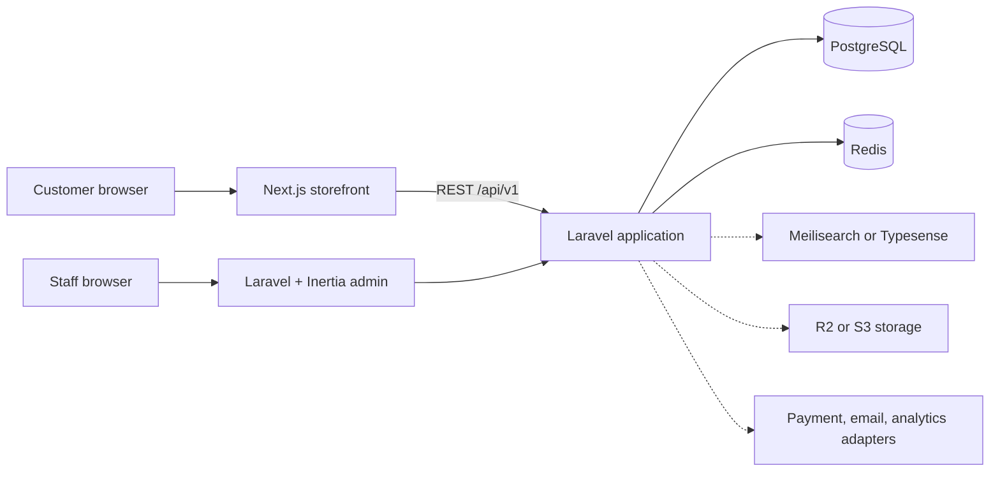

# Architecture

## Shape of the repository

```text
apps/
├── storefront/       Next.js App Router customer experience
└── backend/          Laravel REST API and Inertia admin
packages/
├── config/           shared strict TypeScript baseline
├── types/            transport-safe TypeScript contracts
└── ui/               visual tokens and essential React primitives
```

The repository uses npm workspaces without Turborepo. Two JavaScript applications and three small
packages do not yet justify another task runner. Laravel keeps its independent Composer lifecycle.

## Runtime boundaries



- Next.js owns presentation, route composition, metadata, and storefront caching decisions.
- Laravel owns business rules, persistence, authorization, pricing, inventory, checkout, and
  provider orchestration.
- Inertia is an adapter between Laravel routes/controllers and the admin React UI; it is not a
  second API or a separate application.
- PostgreSQL is the source of truth. Redis is disposable infrastructure for caches, sessions,
  queues, rate limits, and coordination.

## Store context

The current deployment resolves one store from configuration through `ResolvesStore`. Callers depend
on that contract, not on environment variables directly. A later domain/host resolver can replace
`ConfigStoreResolver` without changing controllers or shared Inertia data.

This is multi-store-ready, not multi-tenant-complete. Before the first catalog migration, decide the
tenancy strategy and require `store_id` on store-owned records with composite unique indexes.

## Provider seams

`config/platform.php` declares neutral driver selections for search, asset storage, payments,
transactional email, and analytics. Vendor adapters should be implemented in Infrastructure and
bound to application contracts. Domain objects must remain vendor-agnostic.

## Deployment direction

- Deploy the storefront and Laravel independently behind Cloudflare.
- Keep Laravel workers separate from web processes and supervise queue workers.
- Use private object storage plus signed or transformed delivery where assets are sensitive.
- Terminate TLS at the edge, preserve trusted proxy headers, and use managed PostgreSQL/Redis in
  production.
- Emit structured logs and correlation IDs before introducing distributed workflows.
